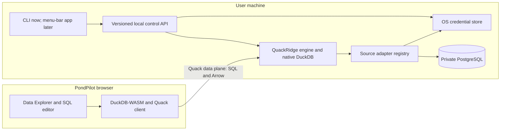

# QuackRidge

Status: Approved on 2026-08-11 — implementation not started
Branch: `design/quackridge`

## 1. Product and process boundary

QuackRidge by PondPilot is a local, cross-platform companion that lets the browser query databases which cannot be reached from DuckDB-WASM. Its first adapter is PostgreSQL, but the core must not encode PostgreSQL-specific behavior. Credentials, native database drivers, and query execution remain on the user's machine. PondPilot connects only to a loopback Quack endpoint and never receives the source credential.

The implementation should be a Go module with a reusable `quackridge` library and a thin `quackridge` executable. Go is preferred over a shared Swift core because DuckDB lists Go as a primary client, it produces straightforward cross-platform helper binaries, and Kavla already demonstrates the adapter-based DuckDB pattern successfully. Swift supports macOS, Linux, and Windows command-line development, but SwiftUI's `MenuBarExtra` is an Apple-platform UI. The official DuckDB Swift client exists, but it is not currently listed among DuckDB's primary or secondary clients. That makes Swift a good macOS presentation layer, but a higher-risk database runtime.

The executable exposes two interfaces over the same library:

- Human CLI commands for configuring sources, inspecting status, starting QuackRidge, and diagnosing failures.
- A versioned local control API over a Unix-domain socket on macOS/Linux and an equivalent local IPC transport on Windows.

The future QuackRidge SwiftUI menu-bar app will bundle the correct signed `quackridge` binary, launch it as a supervised child/helper process, and use the control API. It will not duplicate connection or lifecycle logic and will not link DuckDB directly. Process isolation also lets the app restart a failed engine without crashing the GUI. Quack remains the data plane used by PondPilot; the control API is only for configuration, status, lifecycle, and capability discovery.

References: [Swift platform support](https://www.swift.org/platform-support/), [SwiftUI MenuBarExtra](https://developer.apple.com/documentation/swiftui/menubarextra), [DuckDB clients](https://duckdb.org/docs/stable/clients/overview), [DuckDB Swift client](https://duckdb.org/docs/stable/clients/swift).

## 2. Architecture and component boundaries

The Go module is organized around a library facade rather than CLI commands. The root `quackridge` package owns service startup and shutdown; `engine` owns one native DuckDB instance; `source` defines the adapter interface and PostgreSQL implementation; `config` stores non-secret profile data; `secrets` abstracts Keychain, Windows Credential Manager, and Linux Secret Service; `control` exposes versioned local lifecycle operations. `cmd/quackridge` only parses flags, prompts the user, and calls the library. No command package may contain database behavior.

At startup, the engine loads fixed-version DuckDB extensions, retrieves credentials through the secret abstraction, and attaches every enabled source read-only under a validated alias. QuackRidge exposes a stable catalog containing metadata views; it does not expect users to create projection views manually. PondPilot attaches that catalog through Quack for discovery and lightweight single-relation access.

Each complete SQL statement selected for a QuackRidge source is executed server-side, rather than as independent Quack table scans. This avoids Quack's current multiple-streaming-scan limitation and lets native DuckDB plan joins across PostgreSQL relations. PondPilot remains responsible for editing, statement validation, result presentation, and cancellation UI. QuackRidge owns native execution, query cancellation, source availability, and result streaming.

The control API is not an Internet listener. The CLI and future GUI use authenticated local IPC to modify configuration and inspect health. Quack is a separate loopback-only data plane with a generated token. These boundaries allow the UI, IPC implementation, and source adapters to evolve without coupling them to command parsing or macOS frameworks.

## 3. Configuration, secrets, pairing, and lifecycle

QuackRidge configuration is a versioned document in the platform's application-config directory. It contains source IDs, names, adapter types, validated aliases, non-secret options, and enabled state. Writes are atomic and migrations run before startup. Passwords, credential-bearing DSNs, and Quack tokens are never written there. The `secrets` interface uses macOS Keychain, Windows Credential Manager, or Linux Secret Service; environment-variable injection is supported only as an explicit headless/CI mode.

The initial CLI surface is deliberately small:

- `quackridge source add|list|test|remove`
- `quackridge serve`
- `quackridge status`
- `quackridge doctor`
- `quackridge pair`

`source add postgres` accepts host, port, database, user, SSL mode, and other non-secret fields as flags or prompts, but reads passwords from an interactive secret prompt or standard input—not a command-line argument that would enter shell history. `source test` performs a bounded connection and read-only metadata check without persisting changes. Removing a source deletes its configuration and credential only after an explicit confirmation.

`serve` runs in the foreground by default, owns the DuckDB/Quack lifecycle, handles termination signals, and reports each source independently as ready or unavailable. One broken source does not prevent healthy sources from starting. The library exposes the same context-driven `Start`, `Status`, `Reload`, and `Stop` operations to the future menu-bar supervisor. Installing a login item or system service is outside the first release.

`pair` opens a short-lived loopback HTTP exchange because a browser cannot access the local IPC socket. It produces a high-entropy, single-use nonce, allows only configured PondPilot origins, expires quickly, and returns the Quack endpoint, QuackRidge identity, capabilities, and token once. The permanent management API remains on local IPC. Pairing can be revoked by rotating the Quack token, and PondPilot stores it through its existing encrypted secret-store abstraction. Manual URI/token entry remains available for self-hosted or development builds.

## 4. PondPilot integration and query contract

QuackRidge publishes a protocol version and capabilities through `quack_identify`. PondPilot detects this identity after attaching Quack and creates a QuackRidge execution target. DuckDB and Quack versions are pinned and tested together; an unsupported protocol or missing capability produces a compatibility error instead of falling back to remote-table scans.

PondPilot continues splitting and validating scripts with its existing statement pipeline. When a QuackRidge target is selected, it sends each complete statement through the attached catalog's `query(...)` macro. The existing pinned connection per script tab keeps Quack's server-side session stable across statements, including transactions and temporary objects. Multi-relation joins therefore execute entirely in native DuckDB beside the PostgreSQL attachment. Version one does not mix browser-local relations with QuackRidge relations in one query, and private sources are read-only.

Discovery uses a QuackRidge-owned metadata relation rather than inferring schemas from `current_database()`. It exposes source identity, type and health, schemas, objects, columns, ordinals, DuckDB types, and nullability. Data Explorer, previews, counts, and statistics query this contract server-side. This prevents PostgreSQL catalogs from disappearing from the tree and avoids dependence on DuckDB internals.

Results use Quack's native DuckDB serialization and streaming; QuackRidge does not introduce JSON or a second query transport. Every request carries a PondPilot query ID into structured logs for correlation. Browser cancellation interrupts the pinned Quack client connection, while QuackRidge also enforces configurable execution and resource limits. Because Quack remains beta, cancellation propagation and cleanup after abandoned streams are release-gating integration tests. If either fails with the pinned version, the feature remains experimental until fixed upstream or isolated behind a transport adapter.

References: [Quack overview](https://duckdb.org/docs/current/quack/overview), [Quack reference](https://duckdb.org/docs/current/quack/reference), [Quack deployment and sticky sessions](https://duckdb.org/docs/current/quack/setup/deployment).

## 5. Security and failure model

QuackRidge treats paired-browser SQL as privileged but assumes tokens, origins, or queries can be compromised. Quack binds only to loopback, uses a revocable token, and replaces its permissive authorization callback with a parser-backed policy. Version one allows reads, metadata, transaction control, and scoped temporary objects; it rejects persistent DDL, DML, attachment, extension, secret, filesystem, and configuration statements. A regular-expression allowlist is insufficient because dangerous operations can be nested inside `SELECT`.

DuckDB loads only pinned, signed `postgres` and `quack` extensions before serving. Autoinstall, autoload, community and unsigned extensions, persistent DuckDB secrets, and unnecessary filesystems are disabled. Memory, threads, temporary storage, and duration are bounded; configuration is then locked. The service runs least-privileged, and the future GUI supervises it out-of-process. Platform sandboxing is added where practical because DuckDB settings are not a complete sandbox.

PostgreSQL requires a dedicated read-only role. The adapter uses `ATTACH ... (TYPE postgres, READ_ONLY)`, never persists the DSN in DuckDB, and verifies that startup transactions are read-only. `doctor` warns about obvious write grants. Database grants remain the final control against write-through functions or future extension behavior.

Failures cross boundaries as stable codes: authentication, protocol mismatch, source unavailable, rejected statement, cancelled, timed out, resource exhausted, and internal error. Messages are sanitized before reaching PondPilot. A failed source is quarantined without stopping others; reconnect uses bounded exponential backoff. Queries are not automatically retried because even read operations may be expensive or session-sensitive. Structured local logs include query IDs and timings but redact credentials and SQL text by default. `doctor` reports compatibility, ports, credential-store access, extension hashes, source health, and active limits without exposing secrets.

References: [Securing DuckDB](https://duckdb.org/docs/current/operations_manual/securing_duckdb/overview), [Quack security](https://duckdb.org/docs/current/quack/security), [Securing DuckDB extensions](https://duckdb.org/docs/current/operations_manual/securing_duckdb/securing_extensions).

## 6. Verification, packaging, and release gates

Unit tests cover configuration migration, atomic writes, secret references, adapters, lifecycle, errors, identifier escaping, and authorization. Policy and protocol parsers are fuzzed. Go race tests cover simultaneous queries, cancellation, reload, and shutdown. Credential-store implementations share contract tests backed by isolated test stores.

PostgreSQL adapter tests use an ephemeral container with read-only and write-capable roles. They verify discovery, types, nullability, joins, connection loss, SSL, timeouts, and write denial at both layers. Tests never use an existing developer database.

A pinned DuckDB/Quack suite launches packaged QuackRidge and tests authentication, rotation, identity, metadata, sticky sessions, server-side joins, streaming, rejected SQL, cancellation, abandoned streams, isolation, and clean shutdown. PondPilot Playwright tests exercise pairing, Data Explorer, queries, errors, reconnect, and reload. A regression test proves QuackRidge statements never use direct multi-streaming scans.

Release archives contain one Go executable plus matching signed `postgres` and `quack` artifacts, checksums, licenses, and an SBOM. Startup verifies hashes and works without downloading executable code. CI builds macOS, Linux, and Windows artifacts for supported AMD64/ARM64 targets; an artifact is published only after a native smoke test for that target. The future macOS app embeds the exact same archive contents.

The feature remains labeled experimental while Quack is beta. Release gates are: no credential leakage in config, arguments, or logs; correct complex-type round trips; bounded memory during streaming; server work stops after cancellation; security-policy bypass tests fail closed; and version mismatches produce a guided error. Failing any gate blocks release rather than weakening the policy or silently changing transport.

References: [DuckDB extension platforms](https://duckdb.org/docs/current/extensions/extension_distribution), [DuckDB extension overview](https://duckdb.org/docs/stable/extensions/overview), [Quack troubleshooting](https://duckdb.org/docs/current/quack/troubleshooting).

## 7. Repository, distribution, and delivery

QuackRidge lives in a new `pondpilot/quackridge` repository with an independent Go module and release cycle. Its root exports the service facade and adapter interfaces; DuckDB, PostgreSQL, configuration, credentials, policy, IPC, and pairing remain under `internal/`; `cmd/quackridge` contains only CLI composition. A future `apps/macos` SwiftUI target bundles the released helper and talks only through the control API. The PondPilot repository owns browser pairing, execution routing, metadata presentation, and installation UI.

The QuackRidge repository is the source of truth for versioned protocol schemas, capability definitions, fixtures, and compatibility policy. PondPilot pins a released contract version. QuackRidge CI validates its Go implementation against those fixtures; PondPilot CI downloads a pinned signed QuackRidge artifact for browser tests; a scheduled compatibility job tests PondPilot against the newest prerelease. Protocol changes are backward-compatible for a documented support window, allowing QuackRidge to ship before dependent PondPilot UI.

Each QuackRidge release publishes a manifest at a stable URL containing its version, supported protocol range, per-platform assets, minimum OS versions, SHA-256 hashes, signatures, and release channel. PondPilot detects the OS and architecture and offers the appropriate signed installer plus alternatives. The browser cannot silently install or execute native code: downloading and launching the installer remains an explicit user action. Initial formats are signed archives and package-manager formulas; the later macOS app adds a notarized installer while preserving CLI installation.

Delivery remains phased: first prove packaged DuckDB/Quack, cancellation, authorization, and metadata; then build the Go service and PostgreSQL adapter; then integrate PondPilot; finally add cross-platform packaging and release automation. The technical proof is a go/no-go gate. Version one still excludes writes, cross-engine joins, remote Quack exposure, multi-user sharing, service installation, automatic updates, the macOS GUI, and non-PostgreSQL adapters. New adapters must satisfy the same read-only, metadata, credential, and integration contracts.
